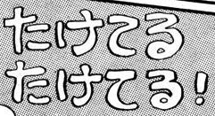
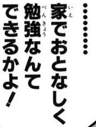
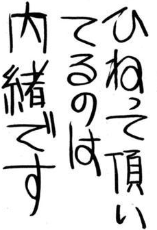
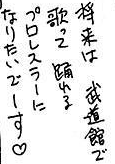

# manga-ocr-nar-preview

[GitHub](https://github.com/muscgab/manga-ocr-nar-preview) · [Hugging Face](https://huggingface.co/muscgab/manga-ocr-nar-preview) · [ModelScope](https://modelscope.cn/models/muscgab/manga-ocr-nar-preview)

## 中文

`manga-ocr-nar-preview` 是面向日文漫画文字裁剪的非自回归 OCR 预览模型。129 个有序 query 在一次前向中预测最多 128 个正文字符和 EOS。词表覆盖日文与英文。

### 使用

```bash
git clone https://huggingface.co/muscgab/manga-ocr-nar-preview
cd manga-ocr-nar-preview
pip install -r requirements.txt
python predict.py crop.png --device mps --precision fp32
```

输入应为已经检测并裁剪的文字区域。`--device` 支持 `mps`、`cuda`、`cpu` 和自动选择。MPS 默认使用 FP32 单图优化路径。

### 真实漫画样例

下列结果来自 step-30000 发布权重的 MPS FP32 推理。四张图片均为固定 Manga109-s v2026 评测集中的真实文字裁剪，Manga109-s 未参与参数拟合或监督训练。

| 输入 | 参考文本 | 模型输出 | 来源与归属 |
|---|---|---|---|
|  | `たけてるたけてる!` | `たけてるたけてる!` | 《愛さずにはいられない》© よし まさこ；Manga109-s |
|  | `……家でおとなしく勉強なんてできるかよ!` | `……家でおとなしく勉強なんてできるかよ!` | 《あっけら貫刃帖》© 小林 ゆき；Manga109-s |
|  | `ひねって頂いてるのは内緒です` | `ひねって頂いてるのは内緒です` | 《あくはむ》© 新居 さとし；Manga109-s |
|  | `将来は武道館で歌って踊れるプロレスラーになりたいでーす♡` | `将来は武道館で歌って踊れるプロレスラーになりたいでーす♡` | 《1・2・3でキメてあげる》© 大宮 直依；Manga109-s |

这些裁剪仅用于展示研究开发结果。使用与归属要求见 [Manga109-s 官方条款](https://manga109.github.io/manga109-project-website/ja/index.html)。

### Apple MPS：batch=1

| 项目 | 便携路径 | 优化路径 |
|---|---:|---:|
| P50 前向延迟 | 130.43 ms | **83.31 ms** |
| P95 前向延迟 | 189.07 ms | **105.89 ms** |
| P50 加速 | 1.00× | **1.57×** |
| 解码一致 | — | **64/64** |

测试环境为 Apple M1 Pro、PyTorch 2.10.0、MPS、FP32，CPU fallback 关闭。step-30000 权重在 64 张冻结 real-dev 图片上逐张运行。时间包含同步后的模型前向；图片解码、约 2.42 ms 的预处理和 CPU-to-MPS 传输单独计算。优化路径保留宽高比和动态 patch 数，使用位置缓存及 Metal RMSNorm、RoPE、SwiGLU 内核。两条路径在全部 64 张图片上产生相同的逐位置 argmax 与解码文本。

先前的 step-10000 测试中，FP16 优化路径达到 74.28 ms P50，64 张中有 63 张与 FP16 基线产生相同文本。FP16 当前保留为实验选项。

### 模型与训练

模型包含 MonkeyOCRv2-B 视觉编码器与 8 层 R2 解码器，共 195,953,570 个参数。解码器宽度为 768，含 12 个注意力头、SwiGLU、Pre-RMSNorm 和 PyTorch SDPA。训练损失由有序交叉熵与权重 0.1 的 occupancy BCE 组成。

训练清单包含 513,361 条筛选后的 AnimeText-OCR 真实伪标签样本和 1,053,440 条合成样本，按 1:1 抽样。合成语料来自日文自然文本、短语组合与少量无语义文本，并加入扫描、JPEG、低分辨率、局部字号变化和轻几何增强。训练使用动态等比输入，面积范围为 224² 至 448²，28 像素对齐。

最终训练运行使用 BF16、有效 batch size 256、30,000 个优化器步、AdamW、1000 步 warmup 和余弦衰减。encoder 学习率为 2e-5，decoder 学习率为 3e-4。

### 评测

完整评测包含 Manga109-s v2026 的 123,212 个真实文字裁剪，来自 87 部作品。所有样本均计入分母，参考文本与输出统一使用固定 NAR 归一化。两模型读取同一组裁剪图片；本模型使用动态等比输入，BaberuOCR 使用其发布的 224×224 预处理与 greedy 解码。

| 模型 | Exact | EM | 编辑距离 / 参考字符数 | micro-CER |
|---|---:|---:|---:|---:|
| **manga-ocr-nar-preview，step 30000** | **92,447 / 123,212** | **75.0308%** | **72,120 / 1,504,251** | **4.7944%** |
| [BaberuOCR](https://huggingface.co/genshiai-daichi/baberu-ocr)，`d9cc131` | 89,302 / 123,212 | 72.4783% | 74,259 / 1,504,251 | 4.9366% |

配对结果中，两者同时正确 80,578 张；仅本模型正确 11,869 张；仅 BaberuOCR 正确 8,724 张。BaberuOCR 按发布配置以 batch 256 评测。两条评测流水线均完整处理 123,212 张图片，运行失败为零。

### 范围与许可

当前版本主要面向日文漫画文字裁剪。英文训练量较少，复杂长文本和 65 字以上文本仍有明显改进空间。模型权重采用 CC BY-NC-SA 4.0，代码采用 Apache 2.0。详细来源和归属见 [`NOTICE.md`](NOTICE.md)。

---

## English

`manga-ocr-nar-preview` is a preview non-autoregressive OCR model for Japanese manga text crops. Its 129 ordered queries predict up to 128 body characters and EOS in one forward pass. The vocabulary covers Japanese and English.

### Usage

```bash
git clone https://huggingface.co/muscgab/manga-ocr-nar-preview
cd manga-ocr-nar-preview
pip install -r requirements.txt
python predict.py crop.png --device mps --precision fp32
```

Inputs should be detected and cropped text regions. `--device` supports `mps`, `cuda`, `cpu`, and automatic selection. MPS uses the optimized FP32 single-image path by default.

### Real manga examples

The following outputs come from MPS FP32 inference with the step-30000 release weights. All four images are real text crops from the fixed Manga109-s v2026 evaluation set. Manga109-s was excluded from parameter fitting and supervised training.

| Input | Reference | Model output | Source and attribution |
|---|---|---|---|
|  | `たけてるたけてる!` | `たけてるたけてる!` | *Aisazu Niha Irarenai*, © よし まさこ; Manga109-s |
|  | `……家でおとなしく勉強なんてできるかよ!` | `……家でおとなしく勉強なんてできるかよ!` | *Akkera Kanjinchou*, © 小林 ゆき; Manga109-s |
|  | `ひねって頂いてるのは内緒です` | `ひねって頂いてるのは内緒です` | *Akuhamu*, © 新居 さとし; Manga109-s |
|  | `将来は武道館で歌って踊れるプロレスラーになりたいでーす♡` | `将来は武道館で歌って踊れるプロレスラーになりたいでーす♡` | *1-2-3 de Kimete Ageru*, © 大宮 直依; Manga109-s |

These crops are included solely to present research and development results. See the [official Manga109-s terms](https://manga109.github.io/manga109-project-website/en/) for use and attribution requirements.

### Apple MPS: batch 1

| Item | Portable | Optimized |
|---|---:|---:|
| P50 forward latency | 130.43 ms | **83.31 ms** |
| P95 forward latency | 189.07 ms | **105.89 ms** |
| P50 speedup | 1.00× | **1.57×** |
| Decoded parity | — | **64/64** |

The benchmark uses an Apple M1 Pro, PyTorch 2.10.0, MPS, and FP32 with CPU fallback disabled. The step-30000 weights run on 64 frozen real-dev images one at a time. Timings cover synchronized model forward; image decoding, approximately 2.42 ms preprocessing, and CPU-to-MPS transfer are measured separately. The optimized path preserves aspect ratio and dynamic patch count, with position caching and Metal RMSNorm, RoPE, and SwiGLU kernels. Both paths produce identical per-position argmax values and decoded text on all 64 images.

In an earlier step-10000 test, the optimized FP16 path reached a 74.28 ms P50 and matched the FP16 baseline text on 63 of 64 images. FP16 remains experimental.

### Model and training

The model combines a MonkeyOCRv2-B visual encoder with an 8-layer R2 decoder, totaling 195,953,570 parameters. The decoder has width 768, 12 attention heads, SwiGLU, Pre-RMSNorm, and PyTorch SDPA. Training uses ordered cross-entropy plus occupancy BCE with weight 0.1.

The training inventory contains 513,361 filtered real pseudo-labeled samples from AnimeText-OCR and 1,053,440 synthetic samples, sampled at a 1:1 ratio. Synthetic text uses natural Japanese text, phrase composition, and a small amount of non-semantic text, with scan, JPEG, low-resolution, local font-size, and mild geometric augmentation. Training uses dynamic aspect-ratio-preserving inputs from 224² to 448² area with 28-pixel alignment.

The final training run uses BF16, an effective batch size of 256, 30,000 optimizer steps, AdamW, 1,000 warmup steps, and cosine decay. The encoder learning rate is 2e-5 and the decoder learning rate is 3e-4.

### Evaluation

The full evaluation contains 123,212 real text crops from 87 works in Manga109-s v2026. Every sample remains in the denominator, and references and outputs use the same fixed NAR normalization. Both models read the same cropped images; this model uses dynamic aspect-ratio-preserving inputs, while BaberuOCR uses its published 224×224 preprocessing and greedy decoding.

| Model | Exact | EM | Edit distance / reference characters | micro-CER |
|---|---:|---:|---:|---:|
| **manga-ocr-nar-preview, step 30000** | **92,447 / 123,212** | **75.0308%** | **72,120 / 1,504,251** | **4.7944%** |
| [BaberuOCR](https://huggingface.co/genshiai-daichi/baberu-ocr), `d9cc131` | 89,302 / 123,212 | 72.4783% | 74,259 / 1,504,251 | 4.9366% |

The paired comparison contains 80,578 samples that both models recognize exactly, 11,869 recognized only by this model, and 8,724 recognized only by BaberuOCR. BaberuOCR was evaluated with batch 256 under its published configuration. Both evaluation pipelines completed all 123,212 images with zero runtime failures.

### Scope and license

This release primarily targets Japanese manga text crops. English training exposure is limited, and complex long text and sequences above 64 characters retain substantial room for improvement. Model weights use CC BY-NC-SA 4.0; code uses Apache 2.0. See [`NOTICE.md`](NOTICE.md) for provenance and attribution.
